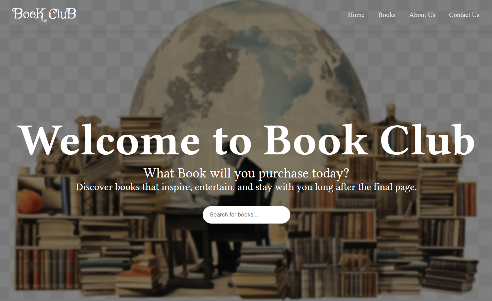

# BookClub

## Overview 
        online bookstore that modernizes the book shopping experience by providing a carefully curated selection of both physical and digital books.Making it easier for readers to discover, browse, and purchase books that inspire and entertain them .Enabling users to explore a diverse collection across multiple genres, with a focus on connecting readers with stories that matter.

#####
ScreenShot of the landing page

## Features
    --Provide a digital platform to discover, browse, and purchase books.
    --Static landing page: Welcoming hero section with search button
    --Browse & Discover:Explore books by category or interest with ease
    --Shopping cart:Add,remove and manage book items in the cart
    --Responsive desgin:Optimized for desktop and mobile device
    --About us:A short introduction to who we are and what our bookstore offers
    --Contact us:User-friendly form for messages, feedback, or inquiries

## Technology used 
    --HTML
    --CSS
    --JavaScript
    --EmailJS(email handler)

## Project structure

BOOK_CLUB/
├── Book/                     
├── images/                    
├── Book_Club_About.css
├── Book_Club_About.html
├── Book_Club_Books.css
├── Book_Club_Books.html
├── Book_Club_Books.js
├── Book_Club_Contact.css
├── Book_Club_Contact.html
├── Book_Club_Contact.js
├── Book_Club_Home.html
├── Book_Club_Home.js
├── Book_Club_Style.css
└── README.md

## Getting Started

### Pre-request
    --A modern web browser
    --Optional but recommended--A code editor(ex-VScode)
    --Optional but recommended--liveserver extension

### Installation 
    1.Clone the repository:
        ``
        git clone https://github.com/EkramJemalH/Book_Club.git
        ``
    2.Navigate to the project directory
        ``
        cd Book_Club
        ``
    3.Open the project
        ``
    Open the folder in your code editor (e.g., VS Code).
        ``
    4. Run the project
        ``
        Simply open the `index.html` file in your browser,
        **or**, if using VS Code with the Live Server extension
        

        Right-click on `Book_Club_Home.html`
        Select **"Open with Live Server"**
        ``

    5.View the app
        ``
        The app will open automatically in your browser or you can manually open `Book_Club_Home.html` directly.

        ``

## How to use 
    Once the app is running, use the navigation bar to:

    --Browse books by genre or category
    --Search for specific titles or authors
    --Add/remove books from your cart
    --View and manage your cart
    --Learn more about the store on the About page
## What is not done yet
    --The cart page

## Contributing
    Feel free to submit issues or pull requests if you want to contribute

## License
    This project is open source and available under the MIT License.

## Connect with me 
    feel free to reach out 
    https://www.linkedin.com/in/ekram-jemalh-446978317/